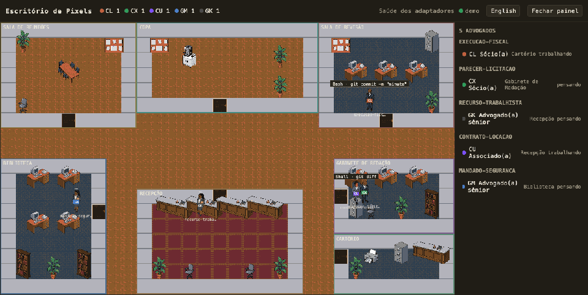

# Escritório de Pixels



Visualizador local, somente leitura, que mostra as sessões das suas CLIs de agentes de IA
como um escritório de advocacia em pixel art. Cada sessão é um advogado que caminha entre
as salas conforme a fase provável do trabalho; subagentes são estagiários que orbitam quem
os recrutou; o último prompt é o caso em andamento.

Feito para ficar num segundo monitor enquanto os agentes pesquisam e minutam peças e
pareceres.

- Servidor local em Node com **zero dependências de runtime**.
- Escuta só em `127.0.0.1`; nada do conteúdo observado vai para disco.
- Funciona com **Claude Code, Codex e Grok CLI** (testados nesta máquina, com fixtures
  reais e aceite ponta a ponta), **Cursor Agent** (instalador pronto e formato confirmado
  pela skill oficial, mas os hooks não dispararam nesta máquina — não validado ponta a
  ponta), **Gemini CLI** (documentado pela documentação oficial, sem teste local) e
  qualquer ferramenta que fale o [protocolo v1](docs/protocolo.md).
- A sala indica a **fase provável** do trabalho, inferida da ferramenta usada — é uma
  aproximação, não um oráculo.

## Como funciona

```
CLI (Claude, Codex, Grok, Cursor, Gemini)
  -> hook nativo (command + curl)
  -> POST /hook/<cli>  ou  POST /eventos      (o servidor normaliza e deduplica)
  -> estado em memória: advogados, estagiários, salas
  -> GET /fluxo (Server-Sent Events: snapshot + deltas numerados)
  -> navegador (Canvas 2D: escritório, HUD, ficha do caso)
```

O servidor decide **o quê** (estado, sala, cargo, atividade). O navegador decide **onde e
como** (posto na sala, trajeto, animação).

## Instalação e execução

Requer Node.js >= 20. Não há `npm install`: não há dependências.

```bash
git clone https://github.com/simiaocavalcanteia-arch/escritorio-de-pixels.git
cd escritorio-de-pixels
node server.mjs
```

Abra <http://127.0.0.1:7777>. Para ver o escritório cheio sem instalar nada:

```bash
node server.mjs --demo
```

| Opção | O que faz |
| --- | --- |
| `--porta N` | usa outra porta (padrão `7777`); fica salva em `~/.escritorio-de-pixels/config.json` |
| `--demo` | sessões sintéticas; recusa eventos externos (para capturas e vídeos) |
| `--ocultar-prompts` | troca o texto do caso por "Caso em andamento (n caracteres)" |
| `--sem-transcritos` | não lê transcritos para estimar tokens |
| `instalar <cli>` / `desinstalar <cli>` | instala ou remove os hooks da CLI |

## Instalar os hooks da sua CLI

```bash
node server.mjs instalar claude    # claude, codex, grok, cursor, gemini
```

O instalador insere só as entradas do Escritório no arquivo de hooks da CLI, preserva o
resto, grava um backup e escreve de forma atômica. `desinstalar` desfaz.

| CLI | Sessão | Prompt | Ferramentas | Subagentes | Modelo | Tokens | Testada nesta máquina |
| --- | --- | --- | --- | --- | --- | --- | --- |
| Claude Code | sim | sim | sim | sim | no início | estimados | sim |
| Codex | sim | sim | sim | sim | em todo evento | totais | sim |
| Grok | sim | sim | sim | sim | não | não | sim |
| Cursor Agent | sim | sim | sim | sim | conforme o payload | não | não (ver Pendências) |
| Gemini CLI | sim | sim | sim | não | em `AfterModel` | em `AfterModel` | não |
| OpenCode | — | — | — | — | — | — | não (v1.1, via `opencode serve`) |

Detalhes, trechos de configuração, particularidades (o Codex pede para confiar nos hooks;
o Grok importa os hooks do Claude e do Cursor) e o esqueleto para contribuir com um
adaptador novo: [docs/adaptadores.md](docs/adaptadores.md).

Outras CLIs falam por `POST /hook/generico?cli=<nome>` (formato snake_case do Claude Code)
ou direto pelo [protocolo v1](docs/protocolo.md) em `POST /eventos`.

## Salas e cargos

As salas são inferidas da ferramenta em uso, por regras em `salas.json` (edite e salve: o
servidor recarrega sozinho; arquivo inválido é recusado e o anterior continua valendo).

| Sala | Fase | Cai aqui |
| --- | --- | --- |
| `recepcao` | espera e pensamento | ocioso, entre turnos, ferramenta sem regra |
| `biblioteca` | pesquisa | `Read`, `Grep`, `Glob`, `WebSearch`, `WebFetch`, busca em geral |
| `gabinete` | minuta | `Edit`, `Write`, `apply_patch`, skills de redação |
| `revisao` | revisão | subagentes de revisão, `code-review`, `security-review` |
| `cartorio` | protocolo e expediente | `Bash`, `shell`, `run_terminal_cmd` |
| `reunioes` | recrutamento e consultas | `Agent`, `Task`, ferramentas MCP |
| `copa` | pausa | esperando permissão ou resposta sua |

O cargo vem do modelo, por regras em `cargos.json`:

| Cargo | Padrões iniciais |
| --- | --- |
| Júnior | `haiku`, `mini`, `nano`, `flash-lite`, `local` |
| Sócio(a) | `fable`, `mythos`, `gpt-6`, `astra`, `ultra`, `grok-5` |
| Advogado(a) sênior | `opus`, `gpt-5.4+`, `gemini-3 pro`, `grok-4` |
| Associado(a) | `sonnet`, `gpt-5`, `gemini flash`, `codex` |
| Advogado(a) | modelo ausente ou sem regra |

`cargos.json` também define a cor e a sigla do crachá de cada CLI. Subagentes são sempre
estagiários.

## Privacidade e segurança

- O servidor escuta **só** em `127.0.0.1`. Não há modo remoto.
- Toda requisição precisa de `Host` local (`127.0.0.1:<porta>`, `localhost:<porta>` ou
  `[::1]:<porta>`); qualquer outro recebe `421`. Isso fecha DNS rebinding.
- `Origin` externo recebe `403`.
- **Nada do conteúdo observado é gravado em disco.** Prompt, detalhe da ferramenta e
  descrição do subagente são truncados na ingestão (200/120/120 caracteres) e só esses
  resumos ficam em memória.
- Transcritos: só são lidos os do diretório da própria CLI (`~/.claude/projects/`,
  `~/.codex/sessions/`), no máximo 64 KB do final, e só para estimar tokens. Desligue com
  `--sem-transcritos`.
- As únicas gravações são de configuração: `~/.escritorio-de-pixels/config.json`, os
  arquivos de hooks e seus backups, e as preferências de idioma e painel no `localStorage`.
- Vai compartilhar a tela? Use `--ocultar-prompts`.
- Sem telemetria. A única chamada de rede externa do projeto é o gerador de arte
  (`arte/gerar.py`), rodado à mão em desenvolvimento.

## Protocolo

Qualquer script pode alimentar o escritório:

```bash
curl -s -X POST http://127.0.0.1:7777/eventos \
  -H 'content-type: application/json' \
  -d '{"v":1,"tipo":"prompt","cli":"meucli","sessao":"abc123","prompt":"Minutar contestação"}'
```

Os dez tipos de evento, campos, limites e exemplos estão em
[docs/protocolo.md](docs/protocolo.md). `GET /saude` mostra o que cada adaptador está
recebendo — é o primeiro lugar para olhar quando um hook parece mudo.

## Contribuindo

Issues e pull requests são bem-vindos, especialmente adaptadores novos. Antes de abrir um
PR: `npm test` (é `node --test test/*.test.js`, sem dependências) e nada de payload real
não anonimizado nas fixtures. O roteiro para um adaptador novo está no fim de
[docs/adaptadores.md](docs/adaptadores.md).

## Créditos

- Inspirado no **Age of Agents** (agentsmill, MIT), mas escrito do zero, leve e neutro
  quanto ao provedor de LLM.
- Arte gerada com **gpt-image-2.5** (OpenAI) a partir dos prompts de `arte/manifesto.json`
  e pós-processada localmente com Pillow: [arte/CREDITOS.md](arte/CREDITOS.md).
- Pessoas retratadas nos sprites são fictícias; não há logos nem marcas de terceiros.

## Licença

MIT — veja [LICENSE](LICENSE). A arte gerada segue a mesma licença.

---

[English version](README.en.md)
